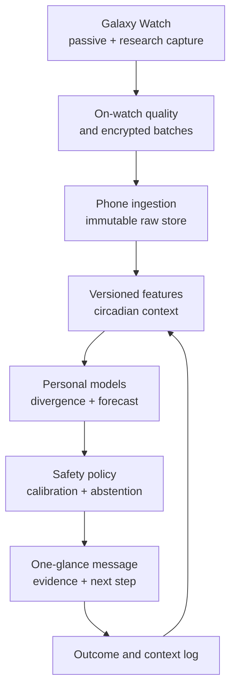
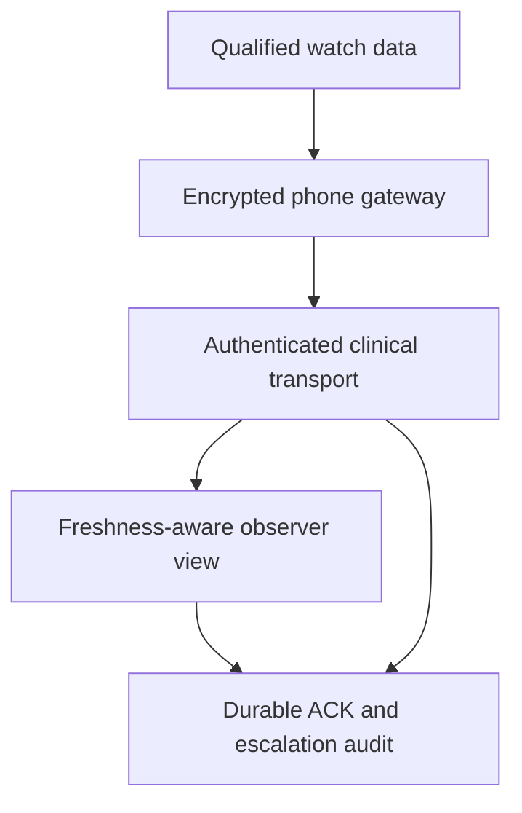

# System architecture

Current status: version `0.5.0-research` implements a deterministic local simulator plus tested platform-neutral encrypted storage, authenticated transport/receipt, crash-safe watch outbox, history reconciliation, prospective forecast audit, standardized-response, adaptive-sensing, empirical-context, governance, provider-neutral reasoning and clinician-observer controls. Public Health Services and Wear Data Layer Android services are source-wired and API-shape tested, but proprietary Samsung adapters, authenticated physical key provisioning, live Samsung Health reads, real Ollama/OpenAI/Anthropic inference and exact-device validation remain locked.

## Design principle

The safety-critical boundary is structural: deterministic collection and quality logic create versioned features; specialized statistical/temporal models create an interpretation; an optional language model may explain only that structured result. A language model never reads a noisy waveform and independently declares a health event.

## Target architecture



## Target hardware and software utilization

| Need | Primary path | Why | Boundary |
|---|---|---|---|
| All-day HR, steps, activity | Wear OS Health Services passive monitoring | Low power, reboot-aware, platform-supported | Baseline context; not continuous raw research |
| Raw PPG, accelerometer, IBI/HR, skin temperature | Samsung Health Sensor SDK on watch | Device-level research signals and Samsung quality/status metadata | Foreground/targeted capture; physical supported watch |
| BIA, ECG, SpO2 and other on-demand measures | Samsung Sensor SDK on-demand tracker | Guided spot measurement | One on-demand tracker at a time; short visible session |
| Processed sleep, HR, SpO2, temperature and Samsung summaries | Samsung Health Data SDK on phone | Historical Samsung Health record | Read-only pilot; public distribution requires Samsung partnership |
| Watch-to-phone transport | Wearable Data Layer + VitalSignal application encryption | Persistent data batches and receipt messages | AES-GCM authenticates payload and metadata; delete only after exact durably claimed phone receipt |
| Wider Android interoperability | Health Connect | Optional user-authorized exchange | Not the primary source for Samsung raw data |
| Optional research observer | Separate authenticated store-and-forward service + monitoring contracts | Scheduled remote research view with explicit freshness, quality and acknowledgement state | Not hospital telemetry; regulated mode remains promotion-locked |

## Data contracts

The model contracts preserve UTC, local offset, unit, quality and provenance. Forecast objects bind a content-addressed endpoint, exact cutoff-anchored target window, content-addressed feature schema/key versions, canonical feature snapshot, model and policy version. Typed forecast features prove source windows end on or before cutoff. Point outcomes preserve an in-window assessment timestamp and are finalized after window close. The encrypted journal preserves hidden commitment, blind pre-reveal context, reveal and outcome across restart. Watch and history boundaries additionally preserve source measurement time, receipt time, device, firmware, adapter, protocol, consent generation and validation receipt. Android key lifecycle still requires physical verification.

```text
SensorSample -> FeatureWindow -> PersonalDeviation -> DomainEvidence
             -> Prediction/Insight -> OutcomeResolution
```

The shared receipt coordinator authenticates application-encrypted batch bytes, commits them to an AES-GCM append journal and only then issues an ACK. The ACK is wrapped in purpose-separated HMAC-SHA-256 before it can reach the watch deletion gate. Byte-identical retries reissue the durable receipt; metadata/tag/MAC corruption, unknown keys, conflicts and storage failures fail closed. The crash-safe watch outbox uses an encrypted, fsynced, atomic snapshot, bounded deterministic retries and exact staged deletion. Consent generation, node, device, path, key and wire digest are rechecked across the route. Physical-device key exchange and Android service lifecycle testing are still required.

## Personal model stack

Implemented now: window quality, 28-day matched median/MAD baselines, correlation-aware fusion, deterministic abstention/safety states, a similarity-weighted binary Bayesian forecast control, encrypted prospective audits, matched standardized-response comparison, battery-aware adaptive sensing, provenance-rich empirical cohort context and a typed/verifier-gated local-AI boundary.

Targeted after the real-data foundation is verified:

1. **Signal gate:** extend current coverage/contact/gap/clipping/motion gates with device status, plausibility, morphology and cross-channel agreement.
2. **Expected state:** add a robust 24/12-hour circadian model conditioned on sleep/wake state, activity, local time and recorded context.
3. **Fast/slow baselines:** add responsive current state plus a slow reference that freezes during reviewed events and major transitions.
4. **Domain fusion:** correlated features are grouped so HR and HRV do not become two independent votes. Opposing normalized directions inside one qualified family create an explicit conflict, give that family zero corroboration and force safety-policy abstention/re-measurement. A `TYPICAL` state additionally requires complete qualified coverage of the endpoint's expected families.
5. **Forecasts:** evaluate the current frozen 72-hour point-assessment control (+72h inclusive to +73h exclusive from feature cutoff) before adding separately versioned endpoints; compare each exact endpoint/schema/key set against persistence.
6. **Calibration:** add rolling-origin scoring and adaptive time-series conformal intervals; current intervals are Bayesian engineering intervals, not calibrated claims.
7. **Change points:** extend the adaptive planner's persistence/cooldown controls into a prospectively calibrated nuisance-alert budget. Current persistence weighting accepts only a verifier-authenticated, provenance-bound chain of strictly prior episodes with chronological timestamps, bounded gaps, interpretation-grade quality and identical family directions; callers cannot supply a persistence count.

## Governance and promotion lane

Code completion and evidence completion are separate. Signed consent grants carry an immutable generation and scopes. Validation receipts bind a capability to the exact app version, device model, firmware and schema. The central access gate denies collection or interpretation on pause, recovery, consent mismatch, expired/invalid evidence or environment mismatch. A separate cumulative promotion gate requires specification, tests and quality evidence even for private shadow research; prospective calibration, reference agreement and human/clinical review for private visibility; external/fairness/privacy/regulatory evidence for public wellness; and clinical performance, quality-system and authorization evidence for medical intended use.

## Foundation-model lane

A frozen, licence-compatible wearable encoder may run as a shadow challenger. It can be promoted only if prospective rolling-time evaluation improves accuracy without worsening calibration, data-quality behavior or alert burden. The handcrafted/statistical pipeline remains the control and provides interpretable safety tests.

## Governed reasoning lane

Ollama, OpenAI Responses and Anthropic Messages all belong behind the numerical and safety layers. A short-lived, length-prefixed canonical health-state packet carries signed metric references, curated evidence, approved measurement/question/template IDs and explicit quality gaps. The signature, exact canonical payload, internally recomputed snapshot hash and time window are verified before model use and again before delivery. A cloud provider receives a second minimized projection that omits subject/issuer IDs and free-text evidence metadata. The model can select reviewed semantic templates and references; it has no prose field and cannot create a metric, probability, intervention or alert. Deterministic UI code resolves template IDs to reviewed copy. The verifier returns pass, rewrite, abstain or a safe static fallback, and the candidate is withheld until its audit record is durably committed.

Provider credentials exist only in a future VitalSignal backend gateway; phone/watch contracts cannot carry them. Signed privacy and provider-account receipts bind consent, purpose, payload class, minimization/redaction, residency and retention. Standard cloud retention is synthetic-only; personal cloud packets require externally evidenced ZDR, while personal Ollama packets require local-only retention. Tools/direct browsing are disabled, shadow challengers never render, and immutable offline candidates require frozen evaluation, human promotion and rollback. The contracts, mocks and OpenAPI draft are tested, but no real provider request or personal packet is enabled. See `docs/LOCAL_AI_OLLAMA.md` and `docs/CLOUD_AI_PROVIDER_BOUNDARY.md`.

## Optional clinician-observer lane

`core:monitoring` separates three purposes: private research logging, a scheduled observed research session, and regulated clinical monitoring. Log-only is non-shareable; scheduled observation can never be labelled as a clinical service. Regulated mode cannot activate unless the central consent/validation gate passes and the cumulative promotion gate authorises the exact medical intended-use feature and environment. Downstream freshness/FHIR-shaped projection consumes a private composite permit that retains purpose and, in regulated mode, the exact medical feature/version/environment evidence; a raw share permit is insufficient.



The observer surface exposes measurement time, receipt time, quality, observer coverage and explicit live/delayed/stale/no-data/authorization/clock/sequence states. Stale or missing data never becomes a normal result. Alert mutations require short-lived signed actor/role/action/version permits, and alert state plus its audit record commit atomically. Heart rate and qualified pulse/ECG research signals are the strongest prospective lane. Respiratory context is secondary: SpO₂, estimated breathing rate, sleep and motion cannot replace airflow, spirometry, capnography, blood gases or a clinical oximeter. A non-deployed OpenAPI contract now records the intended backend boundary; a production route still needs a hospital-approved implementation, identity/access management, staffing model, escalation policy, cybersecurity, human-factors testing, clinical validation, quality system and regulatory authorisation. See `docs/BACKEND_CLINICIAN_PLATFORM.md`.

## Discovery lane

The first implemented shadow discovery primitive compares standardized response episodes. It matches protocol, device and firmware generation, requires 12 qualified episodes over 28 days, preserves unit/provenance matching and needs deviations in at least two independent feature families. The adaptive planner can request—but never silently start—a short validated foreground remeasurement when two independent qualified families remain unusual. The Samsung ECG event contract preserves supplied embedded green PPG, sequence, lead/contact and saturation metadata without transformation; no physical capture or lossless-transfer result is claimed, and timing use remains locked until reference alignment is verified on the exact hardware. Personal analogue search, overnight oxygen burden, circadian integrity and MF-BIA fingerprints remain documented experiments; see `docs/DISCOVERY_BLUEPRINT.md`.

## Target user-facing severity

| State | Meaning | Model action |
|---|---|---|
| Learning | Baseline is immature | Show trends/quality; no health inference |
| Typical | Qualified pattern is within expected personal variation | Explain availability; never say illness is absent |
| Notice | Preliminary one-domain shift | Wait/re-measure/context log |
| Watch | Persistent or corroborated multisystem divergence | Calm bundled explanation and safe monitoring step |
| Check | Strong, persistent, qualified change | Repeat measurement and consider clinical advice based on symptoms |
| Urgent symptoms | User reports a separately reviewed red-flag symptom | Static emergency guidance independent of the AI score |

The model cannot promote itself to an emergency diagnosis. A symptom pathway is deterministic, separately reviewed, and localized for the release country.
