# Governed OpenAI, Anthropic and Ollama assistant boundary

Status: provider-neutral contracts, signed provider-policy attestation, privacy receipt, credential-free gateway DTO, deterministic orchestration, assistant presentation state, offline release governance, mock tests and a non-deployed OpenAPI draft are implemented. No OpenAI or Anthropic key was configured, no real cloud request was sent, and no personal health packet or model result is enabled. This release remains **NO-GO for any provider-generated user result**.

## Product role

The safe product role is **VitalSignal Health Scientist / Research Copilot**: personable, evidence-linked assistance around results the verified system has already computed. It must not present itself as a licensed nurse or clinician, imply that a professional is attending, or become an autonomous medical authority.

| Allowed advisory work | Structurally prohibited authority |
|---|---|
| Select reviewed explanations for verified metrics and forecasts | Read raw/noisy waveforms and independently infer disease |
| Link a reviewed statement to exact metric and evidence IDs | Invent a number, probability, diagnosis or causal conclusion |
| Select a reviewed follow-up question or measurement ID | Prescribe, alter medication, direct a taper or create treatment |
| Explain quality gaps, uncertainty and abstention | Clear an emergency, suppress symptoms or claim illness is absent |
| Adapt tone/detail using non-health persona enums | Store health facts in the persona profile or cultivate dependency |
| Support offline/shadow model comparison | Treat cross-provider consensus as truth or self-promote a model |

Numerical signal processing, personal baselines, sensor fusion, forecasts, quality and urgent symptom policy remain deterministic or specialized-model responsibilities. The language provider receives only a constrained semantic-selection task and returns the existing `LocalReasoningCandidate`, which has no prose or intervention field.

### Fixed workflow, not an autonomous agent

The personal runtime is a bounded explanation workflow:

`verified packet → active signed release → one structured template selection → deterministic verification → durable audit receipt → reviewed local copy`

It has no tools, browsing, memory, autonomous loop, treatment action, alert
authority, background continuation or automatic provider failover. Agentic
systems may be used only offline with synthetic fixtures for evaluation and
red-team generation; their output requires human review and cannot enter the
personal runtime.

Before any provider call is enabled, the gateway must resolve provider, exact
model, prompt, schema, limits and policy from a backend-owned active release
manifest. A phone-supplied provider/model/prompt/schema configuration is not
release authority. Every run receipt and audit event must bind the active
release-manifest hash. This activation binding remains unimplemented and is a
NO-GO gate.

## Two-brain architecture

```mermaid
flowchart LR
    S["Sensors + history"] --> N["Quality + specialised numerical models"]
    N --> P["Short-lived signed health-state packet"]
    P --> G["VitalSignal governed gateway"]
    G --> M["Minimized provider projection"]
    M --> L["Ollama / OpenAI Responses / Anthropic Messages"]
    L --> J["Strict JSON template-ID candidate"]
    J --> V["Deterministic verifier"]
    V --> A["Durable audit before delivery"]
    A --> U["Reviewed UI copy + evidence IDs"]
```

The phone/watch never contains provider credentials and never calls a cloud provider directly. The injected `ProviderReasoningTransport` can address only a configured VitalSignal gateway route ID; it contains no URL, authorization header, API-key or arbitrary tool field. A future backend adapter is the only key holder and must retrieve provider credentials from a managed secret scope at runtime. Provider keys are prohibited from APKs, watch storage, source, logs, crash reports, OpenAPI examples and user exports.

The contract-only network surface is [`backend/openapi/vitalsignal-assistant-gateway-v1.yaml`](../backend/openapi/vitalsignal-assistant-gateway-v1.yaml). It requires short-lived VitalSignal authorization, mTLS, idempotency, canonical signed health/privacy/provider-policy envelopes and exact release hashes. Its response is also a canonical gateway-signed envelope bound to the request, provider, model, prompt, schema, policy and candidate/refusal. There is no deployed service in this checkpoint.

## Data minimization and retention gate

Every invocation carries an authenticated, expiring `ReasoningPrivacyReceipt` bound to the exact signed input snapshot. It records:

- purpose and immutable consent generation/receipt hash;
- `SYNTHETIC_FIXTURE` or `PERSONAL_HEALTH_MINIMIZED` payload class;
- exact transmitted field vocabulary;
- minimization, redaction and total policy hashes;
- residency and retention mode;
- provider-policy attestation ID;
- curated-evidence-only retrieval;
- confirmation that persona preferences are stored separately from health records.

The provider projection includes only input hash; metric ID/value/unit/quality/window; evidence ID/kind/content hash; approved semantic IDs; quality-gap count; policy hash; and persona enums. It omits subject and issuer pseudonyms, packet IDs, evidence titles/URIs/population/free text and quality-gap text. Raw waveforms, contact details, names, date of birth, notes, symptoms, diagnoses, medicines, images and arbitrary history are not representable.

Retention is fail-closed:

| Payload | Ollama | OpenAI / Anthropic |
|---|---|---|
| Synthetic fixture | `LOCAL_ONLY`, or the signed cloud-tenant retention receipt | Signed standard/MAM/ZDR tenant receipt may be benchmarked |
| Minimized personal health | `LOCAL_ONLY` only | `ZERO_DATA_RETENTION` only, with current externally evidenced and signed tenant attestation |

Selecting `ZERO_DATA_RETENTION` or `MODIFIED_ABUSE_MONITORING` in configuration is not proof. The provider-policy attestation is canonicalized, signed by an operator authority, expiry checked and bound to evidence from a provider admin surface or executed data-processing agreement. A forged, expired, mismatched or self-asserted receipt is rejected before transport.

OpenAI states that API data is not used for model training unless the customer opts in, while default abuse-monitoring logs can retain customer content for up to 30 days and Modified Abuse Monitoring/Zero Data Retention require approval. The contract therefore always sets Responses `store=false`, disables background mode, and never assumes MAM/ZDR from public policy alone ([OpenAI data controls](https://developers.openai.com/api/docs/guides/your-data)). Strict JSON-schema output is mandatory ([OpenAI structured outputs](https://developers.openai.com/api/docs/guides/structured-outputs)).

Anthropic structured outputs are also treated as schema conformance, not truth. The schema definition must remain generic and contain no personal/health data; the tenant's retention posture is separately attested ([Anthropic structured outputs](https://platform.claude.com/docs/en/build-with-claude/structured-outputs), [API and data retention](https://platform.claude.com/docs/en/manage-claude/api-and-data-retention)).

## No direct browsing over a personal packet

Provider web search, tools and arbitrary retrieval are disabled by construction. A personal packet cannot be combined with provider browsing. Medical/technical evidence is ingested separately by a curated VitalSignal evidence backend, reviewed, content-addressed and represented to the selector only by an allowed evidence reference. This prevents a provider from leaking personal context into search queries or silently treating an unreviewed page as clinical authority.

## Operational fail-safes

`GovernedProviderReasoningOrchestrator` enforces, in order:

1. signed health-state authority and expiry;
2. exact-canonical signed/expiring privacy receipt plus current consent-ledger status;
3. signed/expiring provider-account policy attestation;
4. exact provider, policy, minimization, retention and residency binding;
5. bounded request bytes and strict generic schema;
6. durable idempotency/replay reservation, rate limit and circuit breaker;
7. transport timeout and bounded response bytes;
8. gateway response canonical equality and trusted signature before any candidate access;
9. exact request/model/prompt/schema/policy response binding;
10. provider refusal or strict structured-output validation;
11. second privacy-receipt/current-consent and health-state authority checks after generation;
12. the existing deterministic `LocalReasoningPolicy`;
13. durable encrypted audit commit before primary delivery.

Any exception, timeout, replay, refusal, mismatched hash, expired consent, unsafe candidate or unavailable audit becomes an abstention or reviewed static blocked state. Missing AI is an availability failure, not a healthy result. A shadow challenger yields only a candidate digest for offline evaluation and never a user-visible candidate.

## Personable without medical-memory leakage

`AssistantPersonaPreferences` contains enums for calm/direct/technical tone, detail, question grouping and number read-out only. There is no name, demographic, symptom, diagnosis, medication, health-record or free-text field. UI state is explicit: `DISABLED`, `READY`, `PROCESSING`, `VERIFIED`, `ABSTAINED` or `BLOCKED`. A verified state contains reviewed disclosure/template IDs plus metric/evidence citations; deterministic code resolves the visible copy.

Mandatory visible disclosures state that the assistant is a research copilot, not a doctor/nurse/diagnosis/treatment/clearance, not an emergency monitor, and limited to reviewed templates plus cited evidence IDs.

## Controlled improvement, not live self-modification

“Self-improvement” means producing a new immutable `ReasoningReleaseManifest` and evaluating it offline/shadow against a frozen dataset and evaluation suite. Production code cannot edit its prompt, schema, policy, model or release pointer. Offline evaluation and human decisions are issued and verified by separate role-specific APIs, pinned signing-key IDs and distinct trust-root fingerprints; cross-role signatures fail closed. The human decision is replay-guarded. Promotion requires:

- exact parent/current/candidate content hashes;
- a minimum offline/prospective case gate;
- grounding and abstention thresholds;
- zero unsafe output, deterministic policy violation, emergency-clearance attempt or treatment-instruction attempt;
- a separately authenticated human `PROMOTE` decision;
- an exact rollback target bound to the current production release.

Provider agreement is only comparison metadata. Even unanimous OpenAI/Anthropic/Ollama output confers no clinical authority and cannot bypass prospective validation or human promotion.

## Implemented test evidence

The provider-specific suite directly tests all three providers; minimized prompt leakage; credential-free/store-disabled requests; signed policy evidence; personal-standard-retention rejection; externally attested personal ZDR; local-only personal use; consent/privacy rejection; forgery; replay/rate/circuit gates; timeout/size/hash/schema failures; provider refusal; deterministic rejection; audit-before-delivery; expiring packet authority; shadow withholding; presentation disclosures/citations; offline promotion; rollback; human approval; unsafe/self-edit prevention; and consensus-not-truth.

Current focused result: **46/46 provider/presentation/release tests passed** with Kotlin `2.3.20` on JRE 17. The complete `core:reasoning` platform-neutral suite passed **110/110** tests. These are offline contract/mock results, not evidence of API connectivity, provider privacy configuration, output quality, clinical performance or production security.

## Gates before any real request

1. Privacy, legal, security and clinical-safety approval of intended purpose and exact data fields.
2. A deployed gateway with managed secrets, mTLS, short-lived identity, regional controls, durable audit/idempotency, monitoring and incident response.
3. Independently capture and sign the exact provider tenant's retention/residency/data-use evidence.
4. Health-free connectivity and synthetic-fixture conformance tests first.
5. Frozen adversarial benchmark covering hallucination, over-reassurance, urgency, prompt injection, missingness and evidence conflicts.
6. Penetration, logging/redaction, deletion/retention, backup/restore and key-rotation tests.
7. Human-factors review of every reviewed disclosure/template and provider-unavailable state.
8. Separate approval before any minimized personal packet; standard-retention personal cloud traffic remains structurally blocked.

Until those gates pass, use only deterministic simulator output and offline mocks. Symptoms and professional medical advice always override the assistant.
