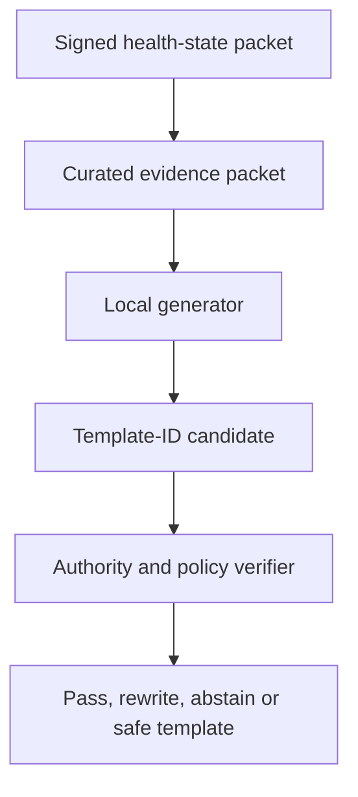

# Governed local AI and Ollama architecture

Status: typed boundary, deterministic verifier, audit-before-delivery orchestrator, transport-neutral Ollama server adapter and verified-path benchmark harness implemented. The real HTTPS transport, wire/structured JSON decoders, gateway authentication and deployment remain gated. Ollama was not installed in the build workspace, no model was downloaded, and no real inference, returned model data or model benchmark is claimed. The current release is NO-GO for any Ollama-generated user result.

## Decision

Ollama is an optional, local **evidence and explanation copilot**. It is not the physiological predictor, signal processor, emergency monitor or treatment authority.

The authoritative stack is:

1. deterministic signal integrity and clock alignment;
2. versioned DSP/features and missingness masks;
3. personal statistical and specialized time-series models;
4. calibrated uncertainty and deterministic safety rules;
5. typed, provenance-bound packet;
6. optional local language explanation;
7. deterministic verification and safe fallback.

This mirrors the strongest current wearable-AI evidence. SensorFM couples a specialized missing-aware sensor representation to a language agent as tools rather than asking an LLM to reason directly over raw streams ([Google Research](https://research.google/blog/sensorfm-towards-a-general-intelligence-and-interface-for-wearable-health-data/), [SensorFM preprint](https://arxiv.org/html/2605.22759v3)). The HeaRTS benchmark reports that general LLMs underperform specialized models as health time-series complexity grows ([HeaRTS preprint](https://arxiv.org/html/2603.06638v3)).

## Allowed jobs

- Convert free-text symptoms/events into a structured draft that the user confirms.
- Retrieve physiologically similar personal episodes from a read-only index.
- Retrieve curated primary evidence with population, device and limitations.
- Select a reviewed explanation-template ID for supplied metrics without changing a number, unit, probability or confidence value.
- Select a reviewed hypothesis-template ID only when disconfirming evidence is cited.
- Identify missing data, confounders and device/firmware mismatch.
- Select patient/clinician semantic templates from the same signed source packet; deterministic UI code resolves the reviewed copy.
- Propose candidate features for offline, sandboxed, leakage-tested research.

## Prohibited jobs

- Reading raw waveform text and calculating HRV, rhythm, oxygen events or probabilities.
- Diagnosing, excluding emergencies, prescribing, changing medication or generating doses.
- Creating, suppressing or escalating an urgent alert.
- Treating cohort means as a personal diagnosis.
- Silently imputing missing sensor values.
- Direct database, shell, arbitrary-code, network or delete access.
- Following instructions embedded in retrieved papers, notes or medical records.
- Treating schema validity, fluent language or model consensus as clinical correctness.

## Structural safety contract

The `core:reasoning` module defines a typed request/candidate/receipt boundary, deterministic `LocalReasoningPolicy` and `VerifiedLocalReasoningOrchestrator`.

- A builder and issuer deep-copy health-state fields, encode them with tagged length prefixes, and sign the exact canonical bytes.
- An injected verifier checks that signature immediately before model use, recomputes the snapshot SHA-256 internally, and enforces issued/not-before/expiry plus a two-minute default maximum TTL.
- `LocalReasoningRequest` has no public construction path; it is created only from a verified packet. Authority is checked again after generation so a packet that expires during inference cannot be delivered.
- Every displayed metric resolves from a `HealthMetricReference` inside that signed packet.
- Candidate claims contain a reviewed semantic/template ID and references only. There is no model-authored prose field; localized UI copy is resolved outside model output.
- Claims may only reference known metric and curated-evidence IDs.
- Unknown templates, templates absent from the packet's signed approval set, and kind/template binding mismatches fail closed.
- Hypotheses require disconfirming evidence.
- Engine forecasts require an authoritative metric reference.
- Suggested measurements must come from a reviewed allow-list.
- User questions are reviewed IDs resolved to static UI copy; the model cannot author a new clinical question.
- Abstention reasons are typed codes rather than model-authored prose.
- Every claim must reference a signed metric, and the language model cannot promote its own certainty to `HIGH`.
- Snapshot mismatches, unknown semantic selections and hidden claims inside abstention fail to `REWRITE`.
- A clean abstention remains an explicit `ABSTAIN`, not a reassurance.
- A candidate is never deliverable until its snapshot/candidate digest, model receipt and policy disposition are committed to a durable encrypted audit sink.
- Model failure, policy rejection or audit failure returns a reviewed static fallback; raw chain-of-thought is never stored.

`OllamaServerAdapter` now enforces a loopback-development or exact allow-listed private-HTTPS endpoint, normal TLS/hostname validation as a transport requirement, no redirects, bounded request/response bodies and timeouts, fixed seed, temperature zero, bounded context/output, pinned prompt/schema hashes, exact Ollama version and pre/post model name/digest/quantisation attestation. HTTP transport and JSON decoders are injected so none can be silently selected by core code. Offline tests cover forged signatures, source/returned-byte mutation, canonical ambiguity, future/expired authority, model-time expiry, unknown templates and no-prose structural challenges; the exact merged result is recorded in `BUILD_REPORT.md`. This is engineering evidence, not a successful model run.

The concrete transport must add gateway authentication and replay protection, use Ollama structured outputs and typed validation, and preserve those limits ([structured outputs](https://docs.ollama.com/capabilities/structured-outputs), [authentication](https://docs.ollama.com/api/authentication)). The adapter cannot be wired into a personal-facing surface until the exact model passes a frozen adversarial benchmark and the governance/promotion gates hold matching receipts.

## Proposer–verifier flow

The critic should preferably use a different model family and look for contradiction, confounding, demographic/device mismatch, prompt injection and overstatement. It is not the final verifier.

## Safe read-only tools

- `get_health_state_packet(window_id)`
- `get_personal_baseline(feature_id, context)`
- `find_similar_personal_episodes(embedding_id, top_k)`
- `list_quality_gaps(window_id)`
- `retrieve_curated_evidence(query, filters)`
- `get_prediction_receipt(prediction_id)`

No generic SQL, filesystem, shell, web or write tool is exposed to a model.

## Deployment recommendation

Ollama has no supported Android product path. The S25 Ultra should remain the collector, encrypted store, user interface and host for purpose-built on-device models. A local workstation/home server can host Ollama behind an authenticated VitalSignal gateway; the phone must never connect directly to an unauthenticated port.

For the private Windows pilot, keep Ollama on `127.0.0.1:11434`, disable cloud features and use Tailscale Serve only for a health-free version/model-inventory check. Do not use Tailscale Funnel. Before any signed health-state packet, replace the direct proxy with the authenticated VitalSignal gateway and allow-list its exact `.ts.net` HTTPS name. The adapter intentionally rejects a remote cleartext IP. `tools/windows/Setup-VitalSignal-Ollama.cmd` performs the connectivity-only setup, derives the server's MagicDNS HTTPS name and saves it beside the script as `VitalSignal-Ollama-Endpoint.txt`, avoiding manual IP copying and without embedding a machine identity in source.

The hosted development workspace could not reach the supplied tailnet peer through its network boundary. That is not evidence that Ollama or Tailscale failed on the server. No prompt, personal health data, inference request or model response was sent. A phone/server connectivity check and a frozen, health-free model inventory must be captured locally before gateway work continues.

Research tiers to benchmark—not endorse clinically—are:

| Tier | Suggested hardware | Generator/critic experiment |
|---|---|---|
| Entry | 32 GB RAM; preferably 8–12 GB GPU memory | Small Qwen-family generator plus local embedding model |
| Recommended pilot | 64 GB RAM; 24 GB GPU memory | Approximately 9B generator and a different approximately 20B critic, sequentially |
| Larger research workstation | 64–128 GB RAM; 48 GB GPU memory | Larger challengers and specialized sensor encoders |

Model names change; promotion is based on a frozen evaluation, not popularity. Pin exact weights/digests, quantization, runtime, seed, prompt, schema and policy. Force local-only mode, bind to loopback, encrypt stores and disable model-initiated web search. Ollama documents `OLLAMA_NO_CLOUD=1` for local-only operation and notes that the local API does not require authentication ([Ollama FAQ](https://docs.ollama.com/faq), [authentication](https://docs.ollama.com/api/authentication)).

## Specialized model lane

Wearable/time-series models run outside Ollama. Candidate research baselines include [TimesFM](https://github.com/google-research/timesfm), [Chronos](https://github.com/amazon-science/chronos-forecasting), [MOMENT](https://github.com/moment-timeseries-foundation-model/moment), [Pulse-PPG](https://github.com/maxxu05/pulseppg) and [OpenTSLM](https://github.com/OpenTSLM/OpenTSLM). These are research dependencies, not validated disease detectors. License, device transfer, sub-second resolution, calibration and external validation must be reviewed before use.

## Required audit receipt

Each run retains:

- input snapshot hash and quality/missingness map;
- numerical model, version and calibration receipt;
- Ollama version, exact model digest, quantization, seed, temperature and context;
- prompt, JSON Schema and policy hashes;
- retrieved evidence IDs/content hashes and their limitations;
- candidate, deterministic failure codes, critic result and final disposition;
- latency/tokens/device class;
- later outcome without rewriting the original prediction.

## Release gates

- 100% schema parse conformance;
- zero numeric claims without signed references;
- zero unit/value mutation;
- citation entailment and evidence freshness;
- correct abstention on missing, conflicting and low-quality data;
- prompt-injection, stale-guideline, demographic/device mismatch, firmware-change and sensor-artifact challenge sets;
- prospective Brier score/calibration, lead time, coverage and false alerts/week;
- chronological/person-level split with an untouched prospective holdout.

No local model can enter the live user-facing path until all gates pass.
