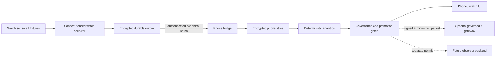

# VitalSignal Research threat model

Status: engineering threat model for `0.5.0-research`; simulator-only release posture. It is not a penetration-test report, production-security certification or clinical safety approval.

## Assets and safety properties

The protected assets are consent state; identity and authorization; raw and derived health records; symptom/context notes; device, firmware and protocol provenance; model inputs and outputs; forecast chronology; audit journals; encryption/signing keys; deletion/export receipts; and the distinction between simulated, research and regulated modes.

The system must preserve confidentiality, integrity, availability, provenance, explicit missingness, chronological truth and human-concern priority. A failure must not turn missing or uncertain data into reassurance, stale data into “live,” a simulator record into a patient record, or an unaudited model result into an action.

## Trust boundaries

The watch/phone radio, Android services, Samsung SDKs, imported history, Ollama server, cloud-model provider, AI gateway and any future clinician backend are untrusted until their exact identity, consent generation, schema, time, quality and authorization are verified. The UI is also a safety boundary: wording, mode labels and missingness cannot be delegated to a language model.

## Primary threats and controls

| Threat | Required fail-safe behavior | Implemented engineering control | Residual validation gate |
|---|---|---|---|
| Lost, duplicated, delayed or reordered watch batch | Retain until an exact durable receipt; deduplicate or quarantine conflicts | Encrypted crash-safe outbox, bounded sequence ledger, authenticated ACK and exact deletion authority | Physical disconnect, reboot, storage-full and radio fault injection |
| Forged ACK deletes unsent data | Never delete | Purpose-separated HMAC, constant-time comparison, batch/session/sequence/wire-digest and durable-commit binding | Android Keystore provisioning/rotation and physical replay tests |
| Corrupt/wrong-key local store | Quarantine and stop; never present an empty healthy history | AES-GCM, authenticated metadata, atomic fsync publication, restart recovery and corruption quarantine | Power-cut, first-unlock, multiprocess and Keystore invalidation tests |
| Consent revoked or generation rolled back | Block callback, storage, transfer and derived use | Signed consent generation and cross-device generation fences | End-to-end pause/delete with an offline watch |
| Imported-history query is broadened after authorization, redirected, or completes after revocation | Abort without committing any returned record; never reinterpret a broad source/scope grant as exact query authority | Immutable source/scope history permit and canonical record/reconciliation contracts | **Real-history NO-GO:** add an authenticated permit bound to exact data types, time range, purpose and destination, then atomically recheck current consent/revocation at completion before durable commit |
| Missing, stale, contradictory or implausible signal | Withhold or mark unavailable; never coerce to normal | Quality hard gates, finite/plausibility checks, freshness/coverage states and abstention | Exact-sensor artifact/reference-device study |
| Charging, battery drain, off-wrist or reboot gap | Record the gap; preserve sequence; require safe resume and baseline rewarming where needed | Platform-neutral lifecycle/resume contracts and durable outbox; Android composition remains gated | Exact-watch lifecycle, thermal and battery campaign |
| Clock, timezone or firmware change | Quarantine or open a new matched stratum | Measurement/receipt time separation; timezone/context/device/firmware/protocol binding; reviewed transitions | Travel, manual-clock and firmware-update hardware tests |
| Partial wear or exercise gaps appear as low activity, normal response or completed recovery | Abstain; expose every classified gap and coverage denominator | Finalized-day qualified-or-gap accounting plus exercise interval, fixed-recovery, quality, source and provenance gates | Exact-watch activity/step/GPS/reference and charging/off-wrist campaigns; current UI is a generated fixture snapshot, not a live engine binding |
| Forecast is changed after outcome or leaks before reveal | Reject mutation; locked view contains no probability | Content-addressed endpoint/schema, hidden commitment, encrypted append-only chronology and replay protection | End-to-end phone UI/outcome collection on the built app |
| Downstream code fabricates or reuses an allowed pilot decision | Deny capability use unless one current exact decision authorizes it | The trusted `core:governance` module is the issuance boundary; its current gate result is opaque to downstream modules, short-lived and bound to subject/capability/consent generation plus consent/validation evidence digests; downstream history/watch permits repeat the central subject, capability, generation and time checks | Treat all code added to `core:governance` as trust-boundary code; add production signer/KMS provisioning, dependency/supply-chain review and composed-app adversarial tests |
| Model invents a diagnosis, number or intervention | Reject and return reviewed static fallback | Signed short-lived packet, template-ID-only candidate, deterministic verifier and audit-before-delivery | Frozen real-model adversarial benchmark; no Ollama result is currently enabled |
| Provider key leaks into APK/source/logs | Block build/deployment and rotate affected key | Phone/watch DTO has no credential/header field; contract assigns key ownership only to a future backend gateway | Secret-manager integration, log inspection, mobile/backend penetration and rotation drill |
| Forged/replayed AI gateway result becomes visible | Reject before parsing/delivery | Exact-canonical gateway signature plus request/model/prompt/schema/policy binding, idempotency and second consent/authority checks | Managed signing-key provisioning/rotation, cross-tenant replay and gateway penetration tests |
| Personal packet enters standard-retention cloud path | Reject before provider transport | Authenticated payload class and privacy receipt; personal cloud use requires externally evidenced signed ZDR attestation | Independent tenant configuration, privacy/legal review and retention/deletion exercise |
| Provider browsing leaks personal context or imports unreviewed evidence | Disable provider browsing/tools and fail closed | Curated-evidence-backend-only enum; minimized projection contains hashes/IDs rather than search text | Egress policy, gateway penetration test and evidence-ingestion review |
| Model self-edits or provider consensus bypasses validation | Keep production frozen and challenger invisible | Content-addressed release/eval/human-promotion/rollback contracts; comparison reports have no user-visible candidate | Deployment-control authorization, rollback drill and independent evaluation |
| Human concern is suppressed by sensors/model | Immediately withhold wearable reassurance; only an authorized human can resolve the app hold | Authority-verified append-only concern ledger and restart-safe encrypted codec | Durable Android composition, session carry-forward and human-factors review |
| Observer data is mistaken for attended monitoring | Show availability/coverage separately and block unauthorized samples | Separate research/regulated modes, purpose-bound permits, validation-blocked state and signed atomic alert actions | Backend IAM, staffing, escalation ownership, penetration and clinical workflow tests |
| Repository leaks secrets, licensed SDKs, tailnet endpoint or health records | CI fails; rotate anything exposed | Ignore rules plus dependency-free repository hygiene scan | GitHub secret scanning, branch protection and periodic manual review |

## Privacy principles

- Local-first and purpose-limited: collect only fields needed by an active, consented protocol.
- Separate identity, consent, data, model and audit scopes; do not use one key or permit for every purpose.
- Store measurement time separately from receipt/processing time and retain source/quality provenance.
- Export and deletion are governed operations with exact targets and completion receipts—not a UI animation.
- Personal records, tailnet endpoints and proprietary SDKs are prohibited from source control.
- Research, commercial wellness and regulated clinical datasets/environments must remain separate.

## Availability without false reassurance

Availability failures are expected. Battery loss, time off-wrist, permission revocation, full storage, missing radio, server downtime, expired authority or an unavailable journal must produce an explicit unavailable/blocked/recovery state. Physiology cannot replace feed availability, and a last known value cannot silently remain “live.”

## Required independent assurance before personal data

1. Full Android build, lint, unit, UI, accessibility and backup/leakage checks.
2. Threat-model review against the composed app and a software bill of materials.
3. Android Keystore/key-rotation, process-death, reboot, storage-full and power-cut testing.
4. Authenticated pairing and malicious/replayed Data Layer traffic tests on the exact devices.
5. Pause, export, deletion and consent-rotation exercises with the watch offline and later reconnected.
6. Mobile/backend penetration testing before any remote personal-data path.
7. Privacy, clinical safety and human-factors review before a participant or clinician relies on the system.

Until these pass, this repository is suitable only for generated-data engineering evaluation.
